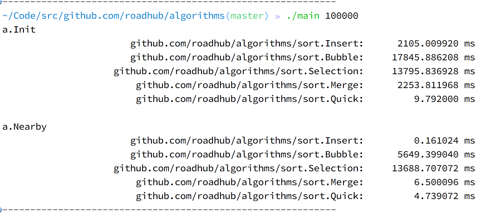

# algorithms 算法

## sort 排序算法
#### O(n^2)
- Buddle sort 冒泡排序
- Selection sort 选择排序
- Insert sort 插入排序 数组的乱序程度越低，插入排序的效率越高，当数组已经是有的时候，时间复杂度为O(n)

#### O(nlogn)
- Merge sort 归并排序
- Quick sort 快速排序

#### 对于 100000= 1X10^6 数据的排序所消耗的时间

